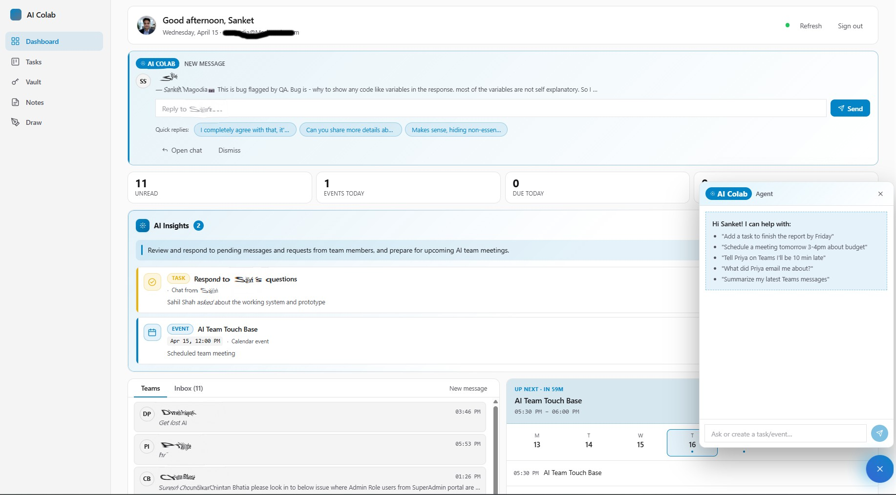

# AI Colab

An AI-assisted productivity workspace that brings your **Microsoft 365** world — Outlook mail, Teams chats, Calendar, To-Do — into a single, focused dashboard. It also ships a lightweight suite of collaboration tools (scrum board, sticky notes, freehand drawing, team password vault) so your squad can think, plan, and build together in one place.



---

## Why this exists

Modern work is fragmented: emails in Outlook, conversations in Teams, tasks in To-Do, meetings on the calendar — and the tools your team uses sit in yet another tab. **AI Colab** stitches those feeds together and layers an AI copilot on top so you can:

- See the day at a glance — unread mail, today's events, overdue tasks, latest chats.
- Reply to a Teams message the moment it arrives, with AI-suggested one-click replies.
- Draft Outlook emails in the tone you want — the AI writes the body and the subject.
- Ask an in-app agent to **read your recent emails and chats**, answer questions about them, **create calendar events or todos**, or even **send a Teams message** for you.
- Collaborate with your team on sticky notes, a drawing canvas, a scrum board, and a shared credentials vault — no more "does anyone have the login?".

---

## Features

### Microsoft 365 dashboard
- **Live feed** of Outlook inbox, upcoming calendar events, Microsoft To-Do tasks across all lists, and the latest Teams chats — polled every 15 seconds.
- **Unified stats row** — unread, events today, tasks due today, overdue.
- **Smart hero** — greets you by name with your avatar pulled from Graph.
- **AI Insights** — click *Analyze activity* for a plain-English summary of what needs your attention, plus one-click accept buttons for suggested tasks/events extracted from recent mail and chat.
- **In-app message banner** — when a new Teams message arrives and the dashboard is open, a rich banner appears with the sender, preview, an inline reply box, and AI-generated quick replies. Messages you sent yourself are filtered out so you never get prompted to reply to yourself.
- **Compose emails with AI** — describe what you want to say; the agent writes a subject + body; you review, tweak, and open it in Outlook.

### Floating AI Agent
A sparkle button at the bottom-right opens a conversational agent that has full context of your recent emails, chats, events, and tasks. It can:
- Answer questions — *"What did Priya email me about?"*, *"Summarize my latest Teams messages."*
- Create a task — *"Add a task to finish the report by Friday."*
- Schedule an event — *"Book 3–4pm tomorrow for a budget review."*
- Send a Teams message in an existing chat — *"Tell Priya on Teams I'll be 10 min late."*

The agent sees the full back-and-forth transcript of your top chats (not just the last line), so it won't re-send something you already said and won't invent recipients who aren't in your chat list.

### Collaboration tools
- **Scrum board** — stories, tasks, assignees, statuses, section selector.
- **Sticky notes canvas** — draggable, colored notes on a shared board.
- **Drawing canvas** — freehand sketch tool (`perfect-freehand`) for whiteboarding.
- **Password vault** — shared team credentials behind the same session gate as the rest of the app.

### Security & privacy
- **JWT-signed session cookie** (`aicolab_token`) guards every `/api/*` route via `middleware.ts`.
- **Server-side Graph proxy** — all Microsoft Graph calls flow through an internal catch-all route (cheekily named `/api/i-got-you/[...path]`) so the browser's network tab never reveals the upstream URL. It greets casual pokers with a friendly HTTP 418 and a cat emoji.
- **Groq API key is server-side only** — never ships to the browser. Requests go through `/api/ai/*` routes.
- MSAL handles Microsoft sign-in via redirect flow; tokens are acquired silently per request.

---

## Tech stack

- **Next.js 14** (App Router) · React 18 · TypeScript
- **MSAL Browser** for Microsoft 365 sign-in
- **Microsoft Graph v1.0** for Mail, Calendar, Teams chats, To-Do, user search
- **Groq** (Llama 3.3 70B by default) for AI drafting, suggestions, and the agent
- **MongoDB** for collaboration data (notes, tasks, credentials)
- **jose** for JWT session tokens
- **SWR** for client-side data fetching in collaboration modules

---

## Getting started

### Prerequisites
- Node.js 18+
- A MongoDB connection string (local or Atlas)
- An Azure AD app registration with delegated permissions: `Mail.Read`, `Calendars.ReadWrite`, `Chat.Read`, `Chat.ReadBasic`, `Chat.ReadWrite`, `Tasks.ReadWrite`, `User.Read`
- A Groq API key (free tier works)

### Setup

```bash
git clone <this-repo>
cd letsColab
npm install
```

Create `.env.local` at the project root:

```env
# Microsoft 365
NEXT_PUBLIC_MS_CLIENT_ID=<your azure app client id>
NEXT_PUBLIC_MS_TENANT_ID=<your tenant id>

# Groq
GROQ_API_KEY=<your groq key>
GROQ_MODEL=llama-3.3-70b-versatile

# Session
JWT_SECRET=<any long random string>

# MongoDB
MONGODB_URI=<your mongo connection string>
```

Then:

```bash
npm run dev
```

Open <http://localhost:3000>.

### Azure AD redirect URI

In your Azure app registration, add `http://localhost:3000/auth-callback` as a **Single-page application** redirect URI. Add your production URL the same way when you deploy.

---

## Project layout

```
app/
├── (protected)/            # Routes gated by the JWT cookie
│   ├── dashboard/          # Microsoft 365 hub + AI agent
│   ├── scrum/              # Scrum board
│   ├── notes/              # Sticky-note canvas
│   ├── drawing/            # Freehand drawing
│   └── passwords/          # Team password vault
├── api/
│   ├── ai/                 # Groq-backed AI endpoints
│   │   ├── agent/          # Conversational agent (answer / task / event / teams_message)
│   │   ├── draft-email/    # Compose an Outlook email
│   │   ├── insights/       # Analyze recent activity
│   │   └── suggest-replies/# Quick-reply pills for Teams
│   ├── auth/               # JWT issue / verify / logout
│   └── i-got-you/          # Microsoft Graph proxy (hides upstream URL)
├── auth-callback/          # MSAL redirect handler
├── layout.tsx
└── page.tsx
components/
├── layout/                 # Header, sidebar, icons
├── scrum/ · notes/ · drawing/ · passwords/ · theme/ · ui/
lib/
├── msal.ts · auth.ts · token.ts · mongodb.ts · types.ts · fetcher.ts
middleware.ts               # Guards /api/* with JWT
```

---

## Scripts

| Command | What it does |
|---|---|
| `npm run dev` | Start the Next dev server |
| `npm run build` | Production build |
| `npm start` | Serve the production build |
| `npm run lint` | Run Next/ESLint |

---

## A note on the `/api/i-got-you` endpoint

If you ever peek at the network tab and wonder why there's a route called "i-got-you" relaying every Graph request — that's the server-side proxy. It hides `graph.microsoft.com` from browser devtools and greets curious visitors with a friendly HTTP 418 and a cat emoji. It doesn't add new privileges; it just scrubs the upstream URL.

---

## License

Private / internal project. All rights reserved by the authors.
